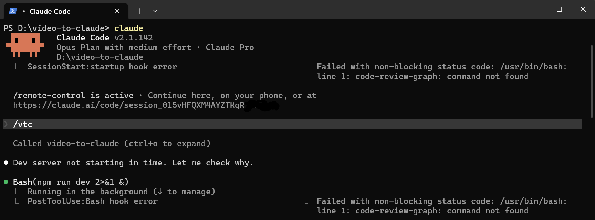
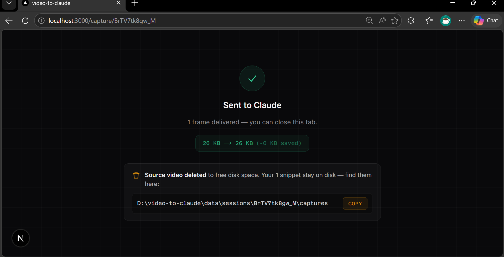
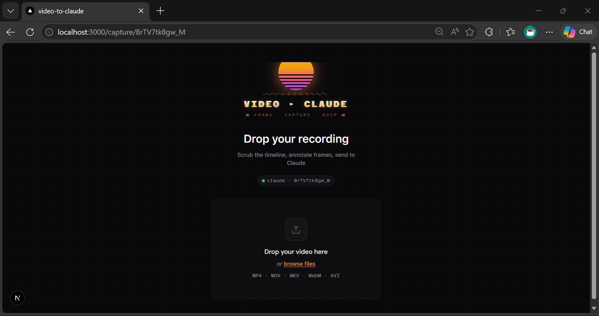
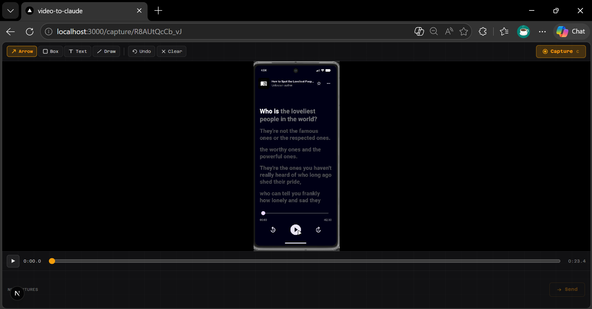
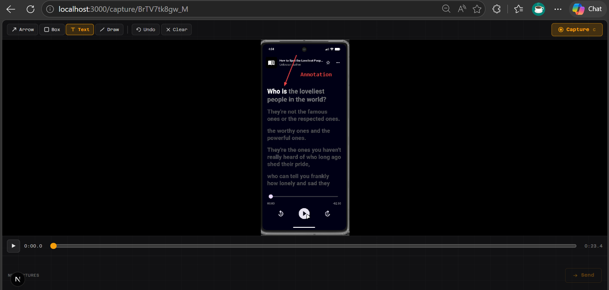
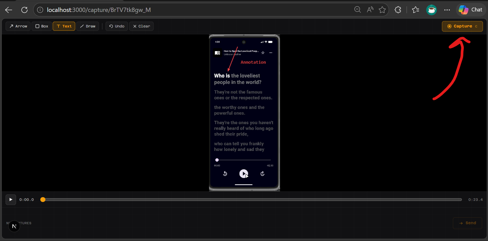

# video-to-claude

Drop a screen recording, scrub the timeline, draw annotations on frames, click Send — the annotated WebPs land directly in your Claude Code conversation as vision input.

<table>
<tr>
<td></td>
<td></td>
</tr>
<tr>
<td align="center"><em>Type <code>/vtc</code> in Claude Code</em></td>
<td align="center"><em>Claude receives your annotated frames</em></td>
</tr>
</table>

---

## How it works

**1. Type `/vtc` in Claude Code**

The MCP server starts the dev server if it isn't running, creates a session, and opens `http://localhost:3000/capture/{id}` in your browser.


**2. Drop your video**

Drag a `.mp4`, `.mov`, `.webm`, or any common video file onto the upload zone. The file is probed with ffmpeg and the player becomes active.



**3. Scrub the timeline**

Use the scrubber or arrow keys to seek to the moment you want to capture. The canvas overlay sits on top of the video frame.



**4. Annotate the frame**

Draw arrows, boxes, freehand marks, and add text labels in red directly on the canvas. These annotations are baked into the exported WebP — Claude sees exactly what you circled.



**5. Capture + repeat**

Click **Capture** to freeze the annotated frame. Repeat steps 3–4 for as many frames as you need. The capture strip at the bottom shows thumbnails.



**6. Send**

Click **Send**. The MCP `await_capture` tool returns, delivering all annotated frames as image content blocks into the Claude Code conversation.


---

## Prerequisites

- **Node.js 18+** (Node 24 recommended)
- **Claude Code CLI** installed ([install guide](https://claude.ai/download))
- Windows, macOS, or Linux
- No Python, no ffmpeg in PATH needed — both are bundled

---

## Install

```bash
git clone https://github.com/adityaO5/video-to-claude
cd video-to-claude
npm install
npm run mcp:build
```

The `mcp:build` step compiles the MCP stdio server to `mcp/dist/`.

---

## Register with Claude Code

### Option A — `claude mcp add` (recommended)

```bash
claude mcp add video-to-claude --scope user -- node /ABSOLUTE/PATH/TO/video-to-claude/mcp/dist/mcp/server.js
```

Replace `/ABSOLUTE/PATH/TO/video-to-claude` with the real path.  
**Windows example:** `C:/Users/you/repos/video-to-claude` (forward slashes work in JSON).

### Option B — manual `~/.claude.json` edit

```json
{
  "mcpServers": {
    "video-to-claude": {
      "command": "node",
      "args": ["/ABSOLUTE/PATH/TO/video-to-claude/mcp/dist/mcp/server.js"]
    }
  }
}
```

### Option C — project scope (`.claude/commands/vtc.md`)

The repo already ships `.claude/commands/vtc.md`. If you open Claude Code inside the cloned directory, the `/vtc` slash command is available immediately after registering the MCP server above.

Restart Claude Code after any config change.

---

## Usage

```
/vtc
```

That's it. The browser opens, you upload + scrub + annotate + send, and the annotated frames appear in the conversation. Claude reads the red marks and acts on them.

---

## MCP tools

| Tool | Description |
|---|---|
| `start_capture_session` | Start dev server if needed, create session, open browser. Returns `sessionId`. |
| `await_capture` | Poll until user clicks Send (default 600 s timeout). Returns annotated WebPs as image content blocks. |

The `/vtc` slash command calls both in sequence automatically.

---

## Vision constraints

- Format: WebP (emitted by the tool)
- Target ≤ 2 MB per frame (hard cap 5 MB); quality retried down from 80 → 50 if needed
- Max width: 960 px
- Practical limit: ~20 frames before auto-downscale; soft cap ~100

---

## Troubleshooting

**Dev server didn't open?**  
Run `npm run dev` in the repo directory, then retry `/vtc`.

**MCP tools not visible in Claude Code?**  
Run `claude mcp list` to confirm registration. Restart Claude Code. Confirm `mcp/dist/mcp/server.js` exists (if not, re-run `npm run mcp:build`).

**Port conflict?**  
The MCP server scans ports 3000–3005 looking for the app. Run `npm run dev` on an open port or stop whatever else is using 3000.

**Upload stalls on large files?**  
The source is uploaded in 512 KB chunks. Very large files (> 2 GB) may take a moment on slow disks.

---

## Tech stack

- **Next.js 16** App Router (Node 24) — UI + REST API
- **ffmpeg-static** — video probing + single-frame extraction
- **sharp** — SVG annotation compositing + WebP encode with quality retry
- **@modelcontextprotocol/sdk** — MCP stdio transport

---

## License

MIT — see [LICENSE](LICENSE)
